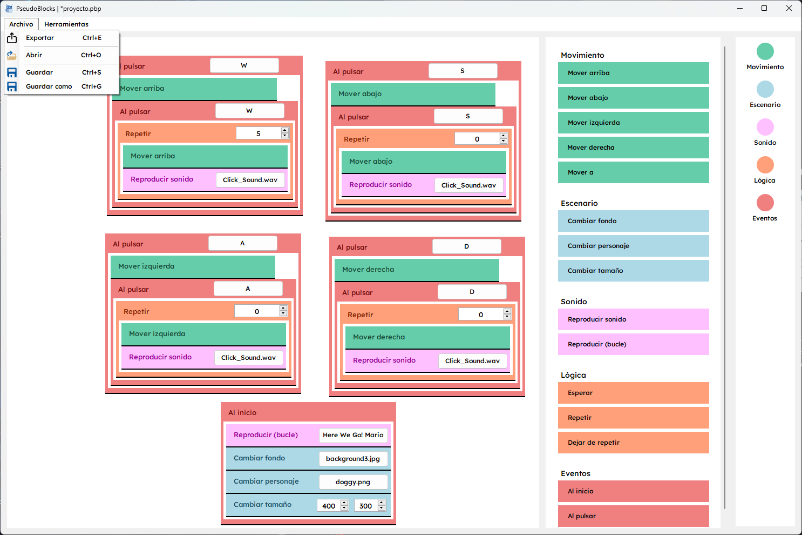
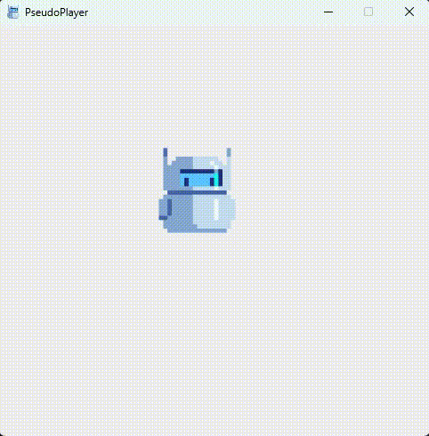

# PseudoBlocks

### 🇪🇸 Español

## Descripción del proyecto

PseudoBlocks es una aplicación que permite a los usuarios crear programas simples mediante una interfaz visual con bloques de pseudocódigo. Los usuarios pueden conectar  bloques de acciones para formar secuencias de instrucciones.

Este proyecto ha sido presentado como mi proyecto final de la asignatura de programación de mi primer año en el doble grado superior de DAM-DAW.

## Funciones existentes

- Añadir, arrastrar, soltar y anidar bloques de pseudocódigo.
- Guardar y cargar proyectos.
- Exportar el pseudocódigo para generar una aplicación ejecutable.

## Capturas de pantalla

## Contribuir

Las contribuciones son bienvenidas. Si encuentras algún problema o tienes sugerencias de mejora, puedes abrir una incidencia o enviar un pull request. Asegúrate de respetar el estilo de código existente.

### 🇺🇸 English

## Project Description

PseudoBlocks is an application that allows users to create simple programs using a visual interface with pseudocode blocks. Users can connect blocks of actions to form sequences of instructions.

This project has been presented as the final project for the programming course in my first year of the Double Degree in Cross-Platform Application Development and Web Application Development.

## Existing Features

- Adding, dragging, dropping, and nesting pseudocode blocks.
- Saving and loading projects.
- Exporting pseudocode to generate an executable application.

## Screenshots

## Contributing

Contributions are welcome! If you find any issues or have suggestions for improvements, please open an issue or submit a pull request. Make sure to adhere to the existing code style.